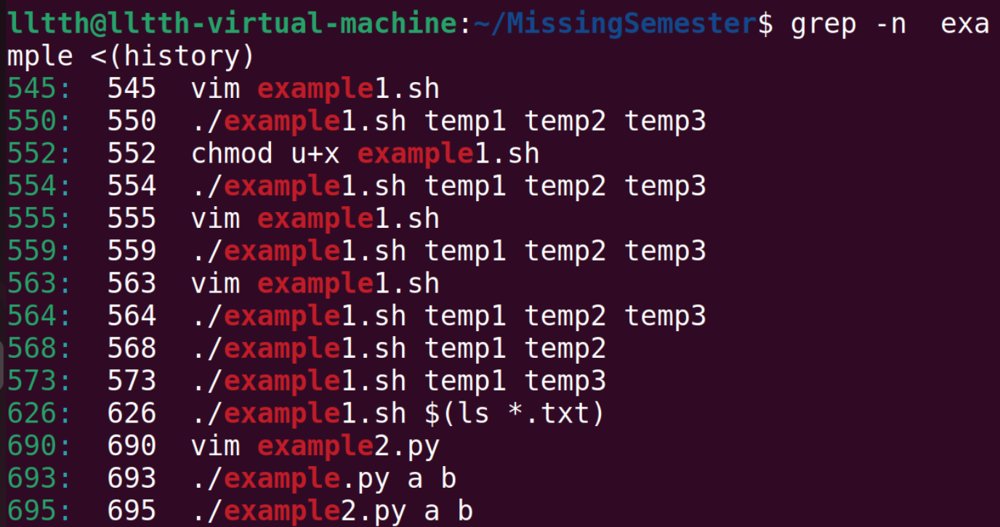

# Missing Semester of Your CS Education

## 课程概览与shell

主要讲了shell的使用。在ubuntu中打开终端即是shell。

输入`date`即可打印当前的日期和时间。输入`echo hello`即可打印'hello'。后面讲了一些切换目录的相关操作。

可以使用help命令了解命令的相关操作。如`ls --help`即可弹出`ls`命令相关的操作。

### 在程序间创建连接

当程序尝试读取信息时，会从输入流中进行读取；打印信息时，会将信息输出到输出流，一般也就是终端。当然，我们可以重定向这些流。最简单的重定向是`< file`与`> file`，分别将程序的输入输出流重定向到文件。注意，`> file`会覆盖原文件中的内容。还可以用`>>`向文件追加内容，即在文件中追加新的行。

也可以使用管道（pipes）更好地利用文件重定向。会在数据清理一章中更详细探讨。

### sys文件相关

在`/sys`中有一些内核参数，比如电脑屏幕的亮度写在`brightness`中，位于`/sys/class/backlight`中。可以从中读取亮度，也可以向其写入亮度。但虚拟机不具备这些功能，不再赘述。

## Shell工具和脚本

### Shell脚本

大部分shell有自己的脚本语言。本节中会专注于bash脚本。

bash中为变量赋值的语法是`foo=bar`，注意不要用空格隔开，因为用空格隔开是执行命令的语法。而访问存储的数值的语法是`$foo`
bash中的字符串通过'' ""均可定义，但使用单引号定义的字符串中的变量不会被转义：

```bash
foo=bar
echo "$foo" #打印 bar
echo '$foo' #打印 $foo
```

bash中也可以定义函数，接收参数并进行操作

```bash
mcd(){
    mkdir -p "$1"
    cd "$1"
}
```

创建一个文件名为`mcd.sh`，在命令行中输入`source mcd.sh`，之后就可以运行`mcd`命令：

其中`$1`是脚本的第一个参数。bash中使用很多特殊变量表示参数、错误代码和相关变量。下面是常用的一些：

- `$0`脚本名
- `$1 - $9`脚本的参数。`$1`是第一个参数，以此类推
- `$@`所有参数
- `$#`参数个数
- `$?`前一个命令的返回值
- `$$`当前脚本的进程识别码
- `!!`完整的上一条命令，包括参数。权限不足时使用`sudo !!`再试一次
- `$_`上一条命令的最后一个参数。对交互式shell，可以按下`esc`后键入来获取这个值

>**进程识别码：** PID（Process Identification）进程标识符，每打开一个程序就会创建一个PID，自动分配，是暂时唯一的，进程中止后就会回收。

举个例子：

命令常用`STDOUT`返回输出值，使用`STDERR`返回错误及错误码。返回值0表示正常执行，非0返回值表示错误发生。

退出码可以与逻辑运算符`&&` “与” `||` “或” 搭配进行条件判断，决定是否执行其他程序。`true`返回0，`false`返回1.它们都是短路运算符。

>**短路运算符**：对于&&和||而言，如果通过前面的表达式就能知道整个式子的结果，那么就不会进行下面的运行。例如对于&&，如果前面运行结果是false，那么结果必然是false，就不会继续运行；同理对于||，如果前面是true，那么也不会继续进行了。missing semester中的几行代码其实就是想要说明短路运算符这件事情。

通过逻辑运算符，使用true/false与命令返回值作运算，观察返回值。如果是true就返回0，false返回1。

另一个模式是用变量的形式获取命令的输出。用*命令替换*模式。也就是将输出赋值给变量:

如果在命令中通过`$()`嵌套一个命令，那么内部的这个命令的输出就会替代这个位置：

还有一种是*进程替换(process substitution)*，写法为`<(command)`或`>(command)`。通过例子来展示：

```bash
cat <(ls) #把ls的输出当成临时文件，然后cat这个文件
ls > >(cat) #把>(cat)当成临时文件
```


同时，学习一下`grep`命令。命令的格式如下：

```bash
grep [options] pattern [files]
```

其中常用的option有：

- -i：忽略大小写
- -v：反向查找，只查找不匹配的
- -n：显示对应行号
- -r：递归查找子目录，也就是把目标目录下的所有文件和文件夹查找一遍
- -l：只打印匹配的文件名
- -c：只打印匹配的行数（输出结果中只有一个行数）


然后是一个简单的脚本。在这之前我们先调整一下vim，让它能够使用系统剪切板；然后在`/stc/bash.bashrc`文件中进行修改，使得`man`界面有彩色，方便我们进行查看。注意，修改文件时候可能没有权限，使用`chmod`命令进行修改权限，可能还需要`sudo`。
程序如下：

```bash
#!/bin/bash

echo "Starting program at $(date)" # date会被替换成日期和时间

echo "Running program $0 with $# arguments with pid $$" # $0是脚本名，$#是参数个数，$$是pid进程识别码

for file in "$@"; do
    grep foobar "$file" > /dev/null 2> /dev/null #/dev/null是一个特殊的文件，会丢弃一切写入的数据；读取会得到一个EOF；这里的>是重定向标准输出stdout，2>则是重定向stderr标准错误文件
    # 如果模式没有找到，则grep退出状态为 1
    # 我们将标准输出流和标准错误流重定向到Null，因为我们并不关心这些信息
    if [[ $? -ne 0 ]]; then #在bash中进行比较时，尽量使用双方括号[[]]而不是单方括号[]，降低犯错的几率
        echo "File $file does not have any foobar, adding one"
        echo "# foobar" >> "$file"
    fi
done
```


运行上面这个程序，如果我们想把所有后缀为`.txt`的文件作为参数，一个一个输入就太慢了，这里引入通配（globbing）。`*`可以匹配任意个字符，而`?`只能匹配一个字符。

除了`*`和`?`以外，花括号`{}`也很好用。如果指令中包含一段公共子串，用花括号可以自动展开。

上面的情况，通过一些实际例子说明：


然后就涉及一点点python了，无论如何先检查python是否装好。使用`python3 --version`命令即可。

下面这个python脚本，效果是将输入的参数反转输出：

```python
#!/usr/bin/python3
import sys
for arg in reversed(sys.argv[1:]):
    print(arg)
```

注意在第一行`#!`中，使用的python3路径是系统自带的python，与missing semester给出的路径不同。这不重要。安装`python-is-python3`后，将上面脚本中的python3换成python同样可以运行。

有两种方式运行它：

```bash
./example2.py a b c
###
python example.py a b c
```

使用`env`命令后的shebang是这样的`#!/usr/bin/env python`。

使用`sudo apt-get install shellcheck`命令安装`shellcheck`工具后可以用来检查shell脚本：

函数只能使用shell语言，而脚本可以使用任意语言。因此shebang是十分必要的。

### Shell工具

讲完了脚本，工具也是必不可少的。

**更精简的手册：** 首先就是更精简的手册。`man`虽然好，但太大了，看起来不方便。`tldr`是精简版的`man`，给出了命令的简单使用例，更加实用。需要注意的是安装`tldr`时候要更新一下库，否则没法用。

**查找文件：** `find`命令可以根据名字、种类（路径还是文件）、修改时间等进行查找，还能对查找到的文件或者路径进行一系列操作。这里不展开了，很巧妙的。给出例子：

`locate`也很好用，实现更加快速的搜索。缺点是只能通过文件名属性来搜索。

>**unix&linux：locate vs find**
locate(1) has only one big advantage over find(1): speed.
find(1), though, has many advantages over locate(1):

**查找代码：** 使用`grep`命令即可，替代品很多，但是不想看了。`grep`在上面已经说过，不再赘述。
但或许有时间还是看一下`rg`，看这个老师操作的，或许一些时候比`grep`有效

**查找shell命令：** `history`命令能够打印出shell的历史命令，结合`grep`命令可以进行搜索。同样可以按`CTRL+R`后输入子串进行匹配。结合`grep`举个例子：
有一个叫`fzf`的工具也很好用：之后就会进入页面：输入就会进行匹配。它是模糊匹配的，并不严格。

**文件夹导航：** `tree`和`broot`命令都能将文件夹和文件按照树状展开，前者会完全展开，后者不会。`broot`就不安装了，展示一下`tree`的功能：
安装`nnn`后可以在shell中图形化地切换目录、访问文件：
`fasd`可以根据访问频率快速跳转，给出一个例子：
其中-l对应的是安装`fasd`后访问文件和文件夹的历史。fasd会自动匹配输入的字符和常访问的文件夹。

>**关于标准输入与输出：**
前面说可以用管道 | 将标准输出送给下一个命令当标准输入。但并不是所有命令都能从标准输入中读取。
可以的例子有：grep [options] pattern [files]。grep命令的files，也就是待查询的，如果参数没有直接给出，就可以从标准输入中读取。例如：echo . | grep -r bin。这个命令就是在当前目录递归搜寻bin，等价于： grep -r bin . 。
但有些命令需要从参数读取输入，这时可以使用xargs命令。这个命令可以从标准输入中读取，将读取到的信息作为后面命令的参数。例如：cat t | xargs ls -l 这个命令将文件t的信息作为后面ls命令的参数。

另：关于**标准输出**
在看ysyx的`linux tutorial`时，给出了这么一个命令：`find . | grep '\.c$\|\.h$' | xargs wc -l`
我很纳闷，这里为什么要加`xargs`，直接通过管道传输标准输入输出就行了吗？
但如果去掉`xargs`后，`wc`就会把`find`输出的文本当成一个文件，对这个文件进行操作。而我们想把输出的文本作为*参数*传递给`wc`，这两个是有区别的
同理，`cat` `grep`命令也能接收标准输入，同样也是把标准输入当成一个文件。
举个例子，当前目录下有一个文件`ex.py`，如果使用命令：`echo ex.py | cat`，会直接输出`ex.py`；如果使用命令`echo ex.py | xargs cat`，就会输出文件中的内容。这里要恰当理解。

## 编辑器（Vim）

## 数据整理

## 命令行环境

## 版本控制（Git）
