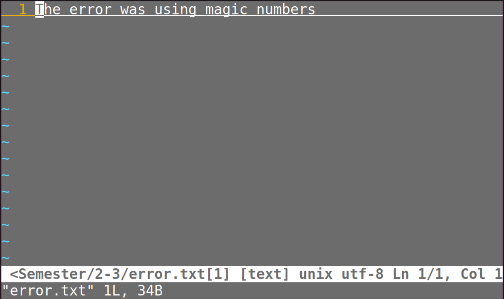

# Missing Semester 前6节 课后习题

## 课程概览与Shell

1. 使用linux完成本课程的练习。使用`echo $SHELL`命令观察shell是否满足要求。
满足要求

2. 在`\tmp`下新建一个名为`missing`的文件夹


3. 用`man`查看程序`touch`的手册
运行`man touch`即可

4. 用`touch`在`missing`文件夹中新建一个叫`semester`的文件


5. 将以下内容一行一行写入`semester`文件：


6. 尝试执行这个文件。将该脚本的路径输入到shell中并回车。使用`ls`命令获取信息，理解不能执行的原因
未能成功执行.
使用`ls -l`命令：

7. 查看`chmod`的手册
使用`man chmod`命令即可

8. 使用`chmod`命令改变权限，使得`./semester`能够成功执行


9. 将`semester`文件输出的最后更改日期信息，写入到主目录下的`last-modified.txt`的文件中
由于这里使用的输出最后更改日期信息的命令不包含管道，因此也就没有使用管道。

10. 写一段命令获取电脑的信息
由于使用的是虚拟机，未找到cpu温度/电量等信息。在/sys/class/thermal中找到了cur_state信息，为0。

## Shell工具和脚本

1. 阅读`man ls`，完成以下任务：
显示所有文件：
人类可理解的格式输出：
最近访问顺序排列：
彩色文本显示输出：
2. 编写两个bash函数`marco`和`polo`执行下面的操作：
执行`marco`时，当前的工作目录以某种形式保存；执行`polo`时，回到当时执行`marco`的文件夹。
为了方便debug，把代码写在单独的文件中，通过`source marco.sh`重新加载函数。

    函数的形式：

    ```bash
    funname(){
        action;
        [return int;] #return可加可不加；如果加，必须是0-255内数值；如果不加，返回最后一条命令的结果。
    }
    ```

    使用命令`source marco.sh`可以加载函数；如果像每次启动shell自动加载，则需要将函数添加到bash的启动文件中，然后重启终端，或重新加载启动文件。
    函数如下：

    ```bash
    marco(){
        pwd > ~/MissingSemester/marco-polo/addr.txt
        echo "This is marco!"
    }
    ```

    ```bash
    polo(){
        cd $(cat /home/lltth/MissingSemester/marco-polo/addr.txt)
        echo "This is polo!"
    }
    ```

    运行结果：

3. 写一个新的脚本，不断运行新的脚本，直到它出错。将标准输出和标准错误流记录到文件，在最后输出所有内容，并报告失败前运行了多少次。

    ```bash
     #!/usr/bin/env bash

    n=$(( RANDOM % 100 ))

    if [[ n -eq 42 ]]; then
        echo "Something went wrong"
        >&2 echo "The error was using magic numbers"
        exit 1
    fi

    echo "Everything went according to plan,n=$n"
    ```

    （多提一嘴，shellcheck对于小白来说太好用了！）
    编写`main.sh`不断运行这个代码：

    ```bash
    #!/usr/bin/env bash

    > ./out.txt
    > ./error.txt

    sum=0

    while true
    do
        ./42.sh >> out.txt 2>> error.txt
        if [[ $? -eq 1 ]]
        then
            echo "The program has run successfully for $sum times"
            bresk
        else
            sum=`expr $sum + 1`
        fi
    done
    ```

    运行结果：

4. 关于`find`命令，实现下面的操作：
编写一个命令，递归地查找文件夹中的所有HTML文件，并将它们压缩成zip文件。注意文件名中包含空格时的情况。（查看`xargs`的参数`-d`）
    这里的关键点是用`xargs`命令。将标准输入转化为参数。考虑到文件可能有空格，在使用`find`命令时记得在最后加上参数`-print0`，在使用`xargs`命令时加上参数`-0`，就能避免名字带空格可能造成的麻烦。
    使用`find . -name "*.html" -print0 | xargs -0 zip my_html.zip`命令即可。运行结果如下：
5. 编写一个命令或脚本，递归地查找文件夹中最近使用的文件；进一步地，按照最近使用的时间列出文件。
一开始以为直接使用`ls -lt -R`命令即可。但问题是：虽然`-R`能够保证递归地展示，但实际列出时是分文件夹一个一个展示的。不同文件夹之间没办法比较。因此可以先用`find`列出所有文件名，再使用`ls -lt`
最后，使用的命令为：`find . -type f -print0 | xargs -0 ls -lt`。运行结果为：
